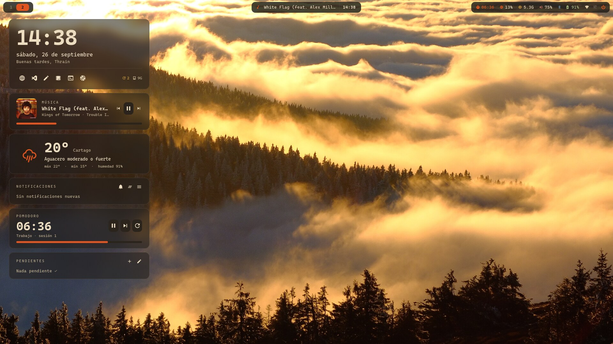

# Tinta · dotfiles de Hyprland



Arch Linux + Hyprland con una paleta cálida y mate (tinta, maple, terracota) en lugar de neón.
Fotos 4K de fondo que rotan solas y una columna de widgets en el escritorio.

## Paleta

| | nombre | hex |
|---|---|---|
|  | tinta (fondo) | `#1d1a16` |
|  | superficie | `#2a241d` |
|  | terracota (acento) | `#e0551f` |
|  | crema (texto) | `#ecdcc0` |
|  | arena (texto 2) | `#bfae90` |
|  | nogal (bordes) | `#5e5245` |
|  | ocre | `#d9a441` |
|  | musgo (segundo acento) | `#93a35a` |
|  | oliva | `#8a9a5b` |

## Qué hay

| | |
|---|---|
| **WM** | Hyprland 0.56, config en Lua (`hypr/hyprland.lua`); animaciones con rebote y borde activo en degradado musgo → terracota que gira |
| **Barra** | Waybar en "islas" flotantes: workspaces numerados (el activo se estira en una píldora), música con ecualizador en vivo (cava) + reloj, sistema, AirPods, cafeína, apagado |
| **Widgets** | eww: reloj con accesos, música (Apple Music web vía MPRIS), clima (wttr.in), notificaciones (swaync), pomodoro, to-do; calendario en español al hacer clic en el reloj |
| **Vista general** | quickshell-overview (Super+Tab) con los colores Tinta: todos los escritorios con miniaturas en vivo, arrastrar ventanas entre ellos |
| **Fuente** | CaskaydiaCove Nerd Font en todo |
| **Fondo** | dos modos: fotos 4K o degradados con grano generados en la paleta (`fondos/generar-degradados.py`); swaybg con `wallpaper-daemon.py` rota cada 30 min, pausa en pantalla completa y reaplica al conectar monitores. Super+W cambia |
| **Lock / idle** | hyprlock + hypridle: fondo actual desenfocado, marco editorial, reloj delgado y una frase para hacer *lock in* en Fraunces suave (`hypr/frases-thrain.txt`) |
| **Terminal** | kitty + starship + atuin (tema `tinta`) + fastfetch "la forja": un casco enano renderizado en 3D (raymarching con numpy → medio-bloques) da una vuelta y THRAIN se forja al rojo vivo (`fastfetch/forja.py`) |
| **Archivos** | yazi con tema Tinta (Super+E); Nautilus en Super+Shift+E |
| **Apps** | GTK: adw-gtk3-dark + colores Tinta (`gtk/gtk.css`), íconos Papirus (carpetas palebrown), cursor Bibata Modern Amber; tema Tinta propio para VS Code (`vscode/`) y Brave (`brave/`) |
| **Menús** | rofi (lanzador y menú de apagado), swaync |

## Atajos útiles

| | |
|---|---|
| Super+Tab | vista de todos los escritorios |
| Super+E | yazi (explorador) · Super+Shift+E Nautilus |
| Super+W | siguiente fondo |
| Super+Shift+W | cambiar entre fotos y degradados |
| Super+T | nueva tarea en el to-do |
| Super+M | Apple Music: abrir / mostrar / ocultar su cajón (sigue sonando oculta) |
| Super+Esc | menú de apagado |
| Super+Shift+S | suspender |

## Instalar

```bash
git clone https://github.com/eduardo00-fv/dotfiles ~/dotfiles && cd ~/dotfiles
./install.sh      # symlinks a ~/.config y ~/.local/bin (respalda lo que exista)
```

Paquetes (Arch): `hyprland hyprlock hypridle waybar eww swaybg swaync rofi kitty starship fastfetch atuin playerctl pacman-contrib jq python python-numpy python-pillow ttf-cascadia-code-nerd cava yazi fd fzf zoxide resvg quickshell adw-gtk-theme papirus-icon-theme`
y del AUR: `yay` (para contar actualizaciones AUR), `quickshell-overview-git`, `bibata-cursor-theme-bin`, `papirus-folders`.

Pasos a mano:
- **zsh:** agregar `source ~/dotfiles/zsh/tinta.zsh` al final de `~/.zshrc` (fastfetch animado y la función `y` de yazi).
- **Brave:** `brave://extensions` → Modo de desarrollador → Cargar descomprimida → carpeta `brave/` del repo (no borrarla después).
- **Calendario en español:** descomentar `es_CR.UTF-8` en `/etc/locale.gen` y correr `locale-gen`.
- **Carpetas:** `papirus-folders -C palebrown --theme Papirus-Dark`.

Las fotos de fondo van en `~/Pictures/Walpapers/fotos/` (no están en el repo). Los degradados se generan con
`python3 fondos/generar-degradados.py 3840 2160 ~/Pictures/Walpapers/degradados`.

## Personalizar

- `bin/airpods-toggle`: pon la MAC de tus audífonos en `~/.config/airpods-mac` (`bluetoothctl devices`).
- `eww/eww.yuck`: accesos rápidos del reloj y monitor (`:monitor` usa el modelo de la pantalla, ver `hyprctl monitors`).
- `eww/scripts/weather.py`: `CITY` vacío = ubicación por IP.

## Mantener al día

```bash
./sync.sh && git add -A && git commit -m "…"
```
